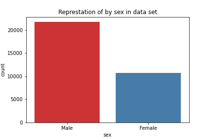

# Waqas's Portfolio

[Project 1. Demographic data analysis](https://github.com/Waqas-Rashid/Data-Analysis-with-Pyhton/tree/main/Demographic-data-analyzer)  
This analysis is peformed to find the different insights based on the peoples gender, race, educational level, hours of work, salaries, and different pattern which we can recognise from it.

Please visit the detailed description, data set and code by cliking the project title.

[Project 2. Medical data visualizer](https://github.com/Waqas-Rashid/Data-Analysis-with-Pyhton/tree/main/Medical-data-visualizer)

[Project 3. Page view time series visualizer](https://github.com/Waqas-Rashid/Data-Analysis-with-Pyhton/tree/main/Page-view-time-series-visualizer)

Description yet to be added.

[Project 4. Sea level predictor](https://github.com/Waqas-Rashid/Data-Analysis-with-Pyhton/tree/main/Sea-level-predictor)

Description yet to be added.

[Project 5.]
